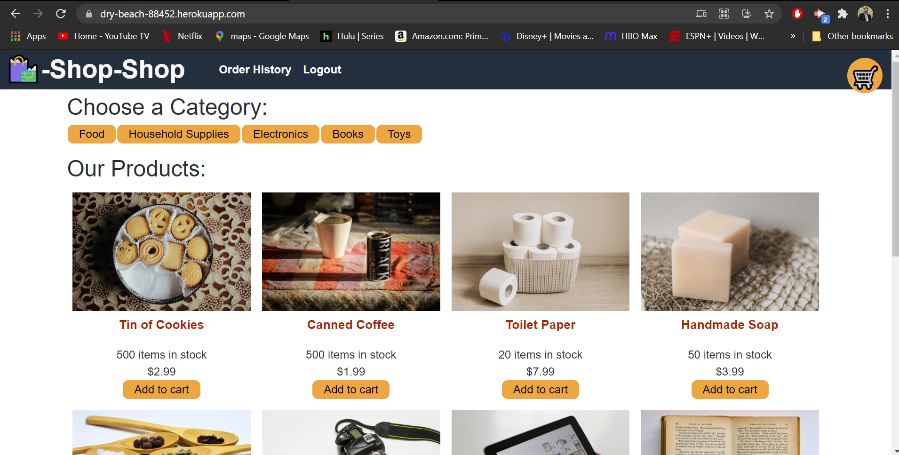

# Redux-Store

## Summary
AS a senior engineer working on an e-commerce platform
I WANT my platform to use Redux to manage global state instead of the Context API
SO THAT my website's state management is taken out of the React ecosystem

## Tools Used

* JavaScript
* Node.js
* Express
* React
* Redux
* Stripe
* Apollo Server
* Graphql
* Mongodb
* Mongoose
* Dotenv
* Heroku

# screenshot

# Table of Contents 
* [Summary](#Summary)
* [Tools Used](#Tools)
* [Snapshot](#Snapshot)
* [Installation & Database SetUp](#Installation)
* [Heroku](#Heroku)
* [License](#license)
* [Contributing](#contributing)
* [Tests](#tests)
* [Questions](#questions)

# Installation & Database SetUp
* To use this app npm init has to be called to create your package.json file.
* The following necessary Npm dependencies must be installed to run the application properly: the needed dependencies will be found on the package.json file.
* To properly install the database you must create at cluster on Mongodb atlas.
* Run "npm run seed" to properly introduce seeded items"
* Run "npm start" for the port to start listening with mongoose.
* This app is deployed on Heroku

# Heroku

(https://dry-beach-88452.herokuapp.com/)

# License

# Contributing
​Contributors: Chdonovan

# Questions?
## Please contact me:
    Email: chrisdonovan311@gmail.com
  * [My GitHub Profile](https://github.com/chdonovan)
  * [My Github Project Repository](https://github.com/chdonovan/shop-shop)
